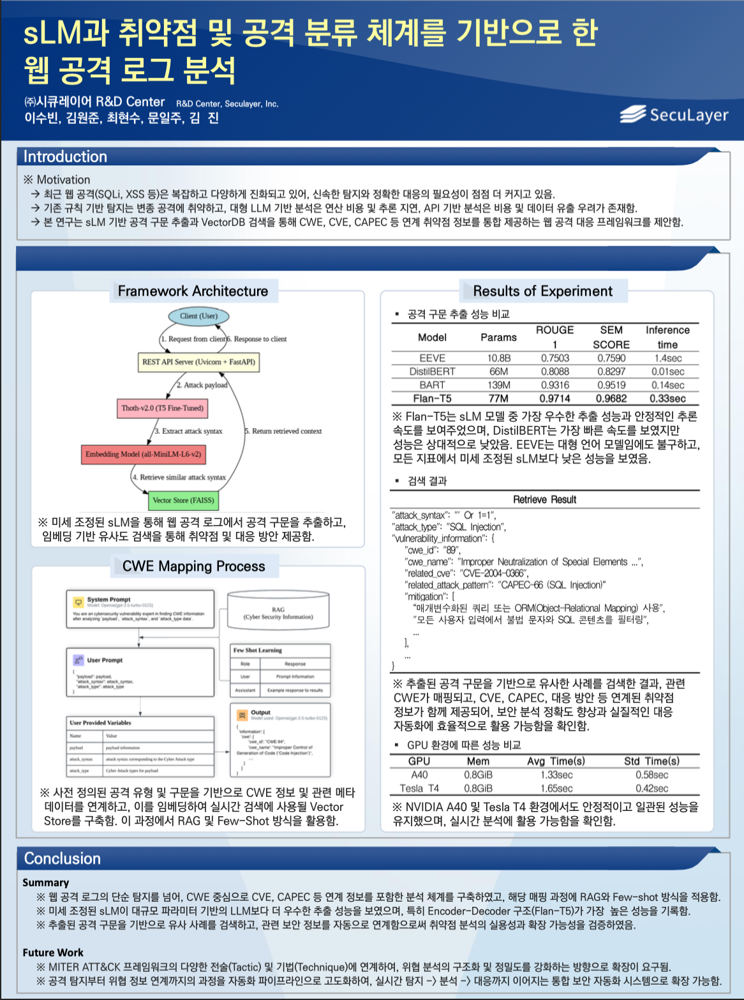

# Web Attack Log Analysis Based on sLM and Vulnerability & Attack Classification Frameworks
> This project presents a lightweight language model (sLM)-based framework that extracts web attack syntax and links it to vulnerability classification systems such as CWE, CAPEC, and CVE for automated analysis and threat interpretation.

## Presented at: 2025 KSII Spring Conference
